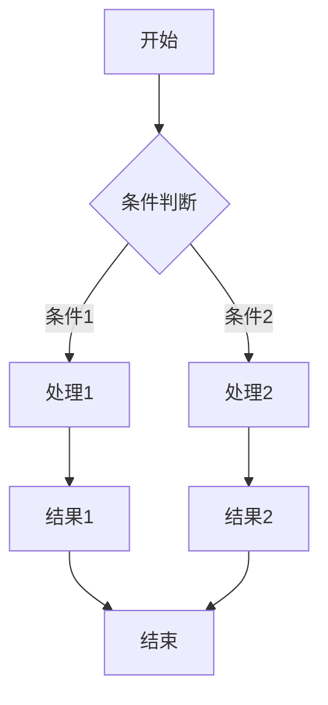

# MD2PDF示例文档

这是一个展示MD2PDF功能的示例文档，包含了各种Markdown元素。

## 目录示例

本文档将会自动生成目录，包括以下章节：
1. 文本格式
2. 数学公式
3. 流程图
4. 表格
5. 代码块

## 文本格式

在Markdown中，可以使用**粗体**、*斜体*、~~删除线~~和`行内代码`等文本格式。

也可以使用不同级别的标题来组织文档结构。

### 列表演示

无序列表：
- 第一项
- 第二项
  - 子项
  - 另一个子项
- 第三项

有序列表：
1. 第一步
2. 第二步
3. 第三步

## 数学公式

MD2PDF支持各种数学公式，包括行内公式和块级公式。

行内公式示例: $E=mc^2$, $\alpha + \beta = \gamma$

块级公式示例:

$$
\int_{-\infty}^{\infty} \frac{1}{\sqrt{2\pi\sigma^2}} e^{-\frac{(x-\mu)^2}{2\sigma^2}} dx = 1
$$

长公式自动换行示例：

$$
\int_{-\infty}^{\infty} \frac{1}{\sqrt{2\pi\sigma^2}} e^{-\frac{(x-\mu)^2}{2\sigma^2}} dx = 1 + \sum_{n=1}^{\infty} \frac{1}{n!} \int_{0}^{\infty} x^n e^{-x} dx + \int_{0}^{1} \frac{1}{1-x^2} dx + \frac{1}{2\pi}\int_{-\pi}^{\pi} e^{i\theta} d\theta
$$

## 流程图

MD2PDF支持Mermaid流程图，示例如下：



## 表格

| 名称 | 类型 | 描述 |
|------|------|------|
| 标题 | 字符串 | 文档的标题 |
| 作者 | 字符串 | 文档的作者 |
| 日期 | 日期 | 创建日期 |
| 版本 | 数字 | 文档版本号 |

## 代码块

Python代码示例：

```python
def hello_world():
    """打印Hello World"""
    print("Hello, World!")
    
if __name__ == "__main__":
    hello_world()
```

## 引用

> 这是一个引用示例。
> 
> 引用可以包含多个段落。

## 水平线

---

## 链接和图片

[MD2PDF GitHub仓库](https://github.com/yourusername/md2pdf)


## 总结

MD2PDF能够将包含各种元素的Markdown文档转换为精美的PDF文件，支持目录生成、数学公式、流程图等功能。 